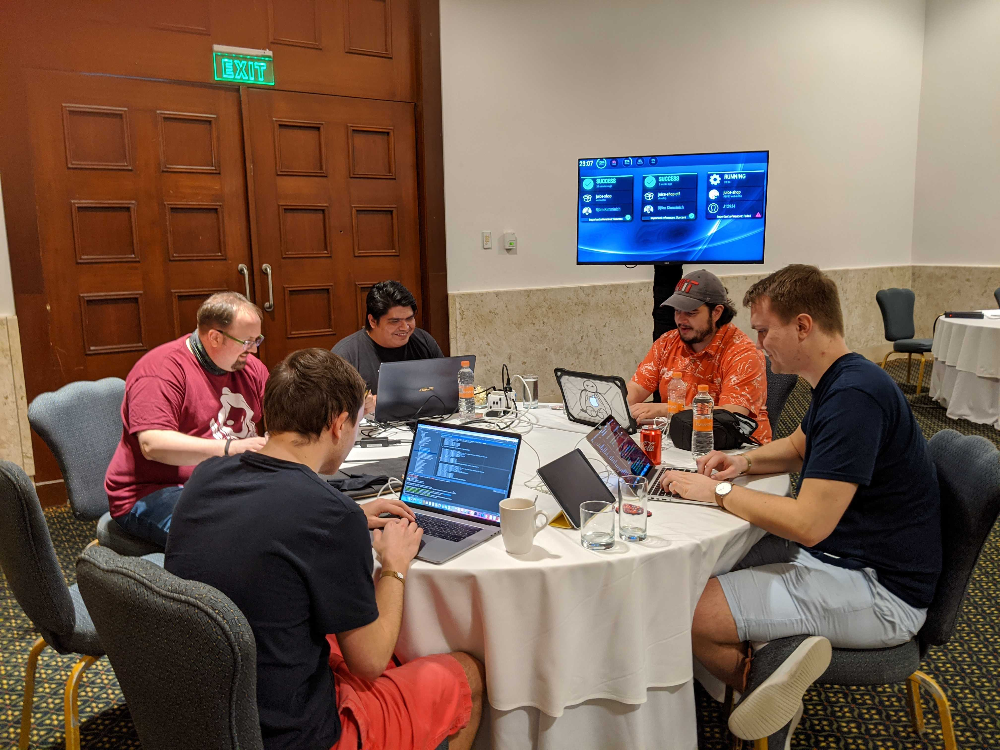

Releasing
[Juice Shop v10.0.0](https://github.com/bkimminich/juice-shop/releases/tag/v10.0.0)
live from the beach of Cancun at the OWASP Projects Summit was a really
unique event.

 

The summit allowed us to really concentrate on some larger long-term
ideas we had. One of them was harmonizing the UI/UX, especially in the
recently extended checkout process. Another was adding more tutorial
scripts for the
[Hacking Instructor](https://pwning.owasp-juice.shop/part1/challenges.html#hacking-instructor)
that guides beginners through some of the easier challenges in the Juice
Shop.

But also some spontaneous ideas were implemented in Mexico, such as a
GitHub Action called LMLFTFY ("Let me `lint:fix` that for you") that -
if necessary - does exactly what the name suggests after each `git
push`.

Juice Shop 10 also contains many other enhancements from before the
summit: The Angular 8 to 9 migration; a refactoring of the structure &
naming in the customization YAML file format; a brand new Prometheus
metrics endpoint that delivers application health stats, "business KPIs"
and challenge progress information.

The latter already has one happy consumer: The convenient
Kubernetes-based [MultiJuicer](https://github.com/iteratec/multi-juicer)
platform offers fancy dashboards for each Juice Shop instance hosted on
it. These can for example help trainers to keep track of how their
students are doing with challenges and also allow them provide better
technical troubleshooting. MultiJuicer `v3.0.0` is needed to make use of
this and also to remain compatible with Juice Shop 10.

As always, you can find the fully updated
[documentation of OWASP Juice Shop online](https://pwning.owasp-juice.shop)
and
[in various eBook formats on LeanPub](https://leanpub.com/juice-shop/)!

One last thing: If you'd like to help us make the Juice Shop even
better, please consider filling out our
[annual online survey](https://forms.gle/2Tr5m1pqnnesApxN8) and telling
us more about your Juice Shop use cases, runtime environment, experience
and feedback!
