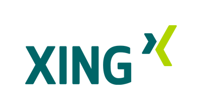
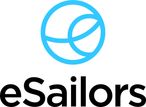
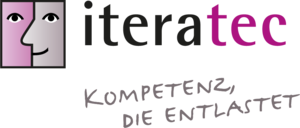
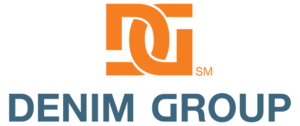

## Project Sponsors 

### Top Sponsors

#### Other Corporate Sponsors

* [PlexTrac](https://plextrac.com)
* [Silpion](https://silpion.de)

#### Other Individual Sponsors

* Jeroen Willemsen
* Soron Foster
* Bendik Mjaaland
* Timo Pagel
* Benjamin Pfänder
* [Björn Kimminich](https://kimminich.de)
* [Kevin Chung](https://twitter.com/kchungco)
* [Brian Johnson](http://www.7minsec.com/)

#### LeanPub Royalties

$1,251.68 of royalties from [Björn Kimminich](https://kimminich.de)'s
eBook have been donated to the project between 09/2017 and 07/2019!
