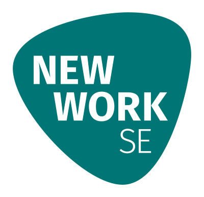

## Project Supporters

> You can attribute your donation to the OWASP Juice Shop project by
> using
> [this link](/donate?reponame=www-project-juice-shop&title=OWASP+Juice+Shop)<!-- @IGNORE PREVIOUS: link -->
> or the green "Donate"-button while on any tab of the Juice Shop
> project page!

### Top Supporters

#### All Corporate Supporters

* [Denim Group](http://www.denimgroup.com/)(2018-2019) <!-- >=1000€ @ 26.08.2018 & 20.09.2019 -->
* [secuvera](https://www.secuvera.de/)(2018-2019)
* [New Work SE](https://www.new-work.se/en/about-new-work-se)(2019) <!-- >=1000€ @ 19.12.2019 -->
* [PlexTrac](https://plextrac.com)(2019)
* [Silpion](https://silpion.de)(2019)
* [iteratec](https://www.iteratec.de/)(2017) <!-- >=1000€ @ 30.11.2017 -->
* [eSailors](https://www.esailors.de/)(2016) <!-- >=1000€ @ 31.07.2017 -->
* [XING](https://corporate.xing.com/en/about-xing/security/)(2016) <!-- >=1000€ @ 26.09.2016 -->

#### All Individual Supporters



* {{ supporter | strip_html | strip_newlines | strip }}

* _You want to appear on this list?_
  [Donate to OWASP here! 🤲](/donate?reponame=www-project-juice-shop&title=OWASP+Juice+Shop)<!-- @IGNORE PREVIOUS: link -->

#### All Corporate-sponsored Code Contributions

* [#1221](https://github.com/bkimminich/juice-shop/pull/1221),[#1356](https://github.com/bkimminich/juice-shop/pull/1356): [Panasonic Information Systems Company Europe](https://application.job.panasonic.eu/data/ruP0pHQvHrGZJKvL/rc.php?nav=jobsearch&custval12=ite&lang=EN&custval11=PBSEU_GER)(2019-2020)

<small><small>_In order to be recognized as a corporate code sponsor an
offical written confirmation of waiving all IP to the contributed code
is required._</small></small>

#### LeanPub Royalties

$1,251.68 of royalties from [Björn Kimminich](https://kimminich.de)'s
eBook have been donated to the project between 09/2017 and 07/2019.

<!--
### Current Project Balance

You can find the current project balance along with a history of all
donations and spendings in the
[Chapter and Project Transactions](https://docs.google.com/spreadsheets/d/14UWhT7SbJAmNBES1ZYdRk8N5f8S2jVkbQbLZz26eM0I/edit#gid=1346179950&range=C323)
spreadsheet.
-->

---

_The OWASP Foundation is very grateful for the support by the
individuals and organizations listed. However please note, the OWASP
Foundation is strictly vendor neutral and does not endorse any of its
supporters._
