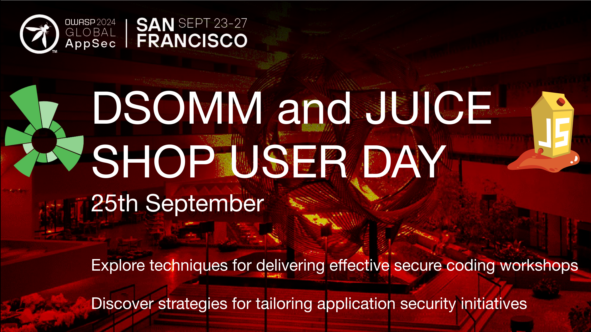

## DSOMM & Juice Shop User Day 2024

The OWASP DSOMM & Juice Shop teams are happy to announce their upcoming shared User Day on **Wednesday, September 25th 2024**. It is part of the OWASP AppSec San Francisco.

### Location

Hyatt Regency San Francisco Address: 5 Embarcadero Center San Francisco, CA 94111 United States

**Room:** Bayview A (Bay Level)

### Registration

1. Go to [OWASP Global AppSec San Francisco 2024 on Eventbrite](https://www.eventbrite.com/e/owasp-global-appsec-san-francisco-2024-tickets-723699172707?utm-campaign=social&utm-content=attendeeshare&utm-medium=discovery&utm-term=listing&utm-source=cp&aff=ebdsshcopyurl)
2. Click _Get Tickets_
3. Scroll down to **Elevate: DSOMM and Juice Shop User Day (Sept. 25)** and add ticket(s) to basket for $55.20 each\*
4. Click _Checkout_

<small>\* = covers fees for room, AV, and catering throught the day.</small>

### Agenda

| Time                 | Title                                                                                   | Facilitator                                                     |
|----------------------|-----------------------------------------------------------------------------------------|-----------------------------------------------------------------|
| <small>9:00</small>  | Welcome: **Juice Shop Morning**                                                         | <small>Björn Kimminich & Timo Pagel</small>                     |
| <small>9:05</small>  | <small>Juice Shop Introduction</small>                                                  | <small>Björn Kimminich</small>                                  |
| <small>9:30</small>  | <small>Shake Logger XSS Demo</small>                                                    | <small>Timo Pagel</small>                                       |
| <small>9:45</small>  | <small>Multi Juicer Introduction</small>                                                | <small>Jannik Hollenbach</small>                                |
| <small>10:30</small> | <small>Just-for-fun-CTF w/ Multi Juicer</small>                                         | <small>Jannik Hollenbach</small>                                |
| <small>12:30</small> | <small>Lunch Break (w/ Juice Shop Ask-us-Anything Session)</small>                      | <small>Björn Kimminich & Jannik Hollenbach & Timo Pagel</small> |
|                      |                                                                                         |                                                                 |
| <small>13:30</small> | Welcome: **DSOMM Afternoon**                                                            | <small>Björn Kimminich & Timo Pagel</small>                     |
| <small>13:35</small> | <small>Application Security Program Experiences / Ask Anything</small>                  | <small>Brook Schoenfield & Timo Pagel</small>                   |
| <small>14:30</small> | <small>DSOMM Live Assessment for the OWASP Juice Shop Application</small>               | <small>Björn Kimminich & Jannik Hollenbach & Timo Pagel</small> |
| <small>15:30</small> | <small>Reach your Dynamic Depth with OWASP secureCodeBox</small>                        | <small>Jannik Hollenbach</small>                                |
| <small>16:30</small> | <small>Workshop: Application and Vulnerability maturity Model (VMM) - DSOMM Map</small> | <small>Francesco Cipollone & Timo Pagel</small>                 |
| <small>18:30</small> | <small>Wrap Up</small>                                                                  | <small>Timo Pagel</small>                                       |

### Talk Descriptions

#### Juice Shop Introduction

In the brief session, you will learn all the basics of the OWASP Juice Shop project: Why it exists, what it can do, where you can get it from, and how to get it running! This session will make sure that newcomers and experts alike can enjoy and follow in the subsequent Juice Shop sessions!

#### Shake Logger XSS Demo
Cross-Site Scripting (XSS) demonstrations in secure coding training often rely on simple alert boxes, which can understate the true risks of this vulnerability. This session will show you how to effectively illustrate the damage potential of XSS to both developers and non-technical audiences, providing a more realistic and compelling demonstration of its impact.

#### Multi Juicer Introduction

_Coming soon..._

#### Just-for-fun-CTF w/ Multi Juicer

_Coming soon..._

#### Application Security Program Experiences / Ask Anything
Brook and Timo will talk about their experiences with Application Security Programs.
Everyone is invited to join the conversation. Please bring your questions!

#### DSOMM Live Assessment for the OWASP Juice Shop Application
In this session, Timo will perform an assessment of the OWASP Juice Shop by interviewing other Juice Shop Core Members by filling out custom yaml files. Learn how to lead a DSOMM interview and at the same time fill out the DSOMM yaml files to document the assessment.

#### Reach your Dynamic Depth with OWASP secureCodeBox
Implementing automated scanning for applications within an organization presents a complex task due to various factors. While configuring the scans themselves poses a challenge (DSOMM subdimension "Dynamic depth for applications"), interpreting and utilizing the resulting data in a meaningful way is often even more challenging (DSOMM subdimension "Consolidation").

This presentation aims to provide guidance on how to utilize the [OWASP secureCodeBox](https://www.securecodebox.io/) project as a tool to automate dynamic scans, leveraging tools such as ZAP, Nuclei, and SSLyze. Specifically, it will demonstrate how to either schedule regular scans or automatically create them via the [AutoDiscovery](https://www.securecodebox.io/docs/auto-discovery/overview) feature of the secureCodeBox. The talk will also highlight the ability to utilize the secureCodeBox for automated creation of scans on Kubernetes deployments.

Furthermore, this presentation will showcase how the secureCodeBox can be used to automatically upload and organize scan results to [OWASP DefectDojo](https://defectdojo.com/), streamlining your security workflow.

#### Workshop: Application and Vulnerability maturity Model (VMM) - DSOMM Map
Organizations face an ever-increasing risk of cyberattacks and data breaches. Vulnerabilities are getting discovered faster than ever, with a 34% YoY increase of vulnerability discovery. Vulnerabilities are often tackled as they come from security scanners, leading to burnout of security professionals, with 50% of security engineers considering changing their profession entirely. This workshop explores the vulnerability management process that applies to application, cloud, and infrastructure security.

To mitigate these risks, vulnerability management and triage have become essential components of an effective cybersecurity program. Vulnerability triage, in particular, plays a critical role in identifying, prioritizing, and remediating vulnerabilities to minimize the organization's attack surface across applications, cloud and infrastructure. However, the process of vulnerability triage is not a one-size-fits-all approach and requires a maturity model that reflects the organization's current state of readiness. In this workshop, you will explore the evolution of vulnerability management and triage process maturity and how organizations can enhance their capabilities to manage and mitigate cybersecurity risks effectively.

Why we created the vulnerability management process?
We created the vulnerability maturity model to provide a quick and easy assessment method to define where you are in the vulnerability assessment process from triage.
The VMM is mapped back to both SAMM, and DSOMM.

### Speakers

#### Bio Brook

Books by Brook S.E. Schoenfield include Building In Security At Agile Speed (Auerbach, 2021, co-authored with James Ransome), Secrets Of A Cyber Security Architect (Auerbach, 2019) and Securing Systems: Applied Security Architecture and Threat Models (CRC Press, 2015). He co-authored The Threat Modeling Manifesto (2020), Threat Modeling Capabilities (2023), Avoiding the Top 10 Security Design Flaws (IEEE, 2014) and Tactical Threat Modeling (SAFECode, 2017). He has taught 100’s of security architects, and 1000’s have attended his threat modelling trainings. He technically led five AppSec/software security programs and 4 consulting practices. Currently, Mr. Schoenfield works with organizations to improve their software security practices as CTO and Chief Security Architect at Resilient Software Security. He also teaches at the University of Montana. He regularly speaks at conferences and appears in podcasts/webinars. Please see https://www.linkedin.com/in/brookschoenfield/ or brookschoenfield.com for details.

#### Bio Francesco

Francesco is a seasoned entrepreneur, CISO & Founder of the code to runtime Contextual-Based Actionable ASPM platform Phoenix Security, author of several books, host of multi-award Cyber Security & Cloud Podcast, speaker and known in the cybersecurity industry and recognized for his visionary views. He currently serves as in the board of UK&I Cloud Security Alliance Chapter,. Francesco Has appeared in several publication like Forbes, Helpnet Security, Hacker noon and interviewed as part of Forbes, Il fatto quotidiano and many other newspapers. Francesco is a faculty member at IANS on application security and cloud security. Francesco is often featured in popular podcast like Application Security weekly, down the rabbit hole, Cloud Security Podcast, appsec weekly. Francesco is frequently speaking at conferences nationally and internationally, Appsec Cali, open security summit, Cyber security & Cloud Expo,
Previously, Francesco headed HSBC’s application and cloud security and was Senior Security Consultant at AWS. Francesco has been keynoting at global conferences and has authored and co-authored several books, whitepapers, Outside of work, you can find me running marathons, snowboarding on the Italian slopes, and enjoying single malt whiskeys in one of my favourite London clubs.

#### Bio Jannik

Jannik Hollenbach is a Software Security Engineer at iteratec GmbH, working on and with open source security testing tools to continuously detect security vulnerabilities in the companies software and systems.

He is also a member of the OWASP secureCodeBox & OWASP Juice Shop project teams.

#### Bio Timo

With over 20 years of experience in DevSecOps, security, and web development, [Timo Pagel](https://www.linkedin.com/in/timo-pagel-80900b81/) is a freelance consultant committed to helping clients achieve reliable and secure cloud solutions. Holding CCSP and CEH certifications, Timo possesses vast knowledge secure design and application security programs.

As a DevSecOps architect, Timo collaborates with multiple organizations to design, implement, and monitor best security practices, workflows automation, and integrate security testing tools.

Timo loves Open Source and is the leader of the OWASP DevSecOps Maturity Model (DSOMM).

Additionally, Timo provides training and mentorship on security in web applications, both as a freelancer and a university lecturer. Timo's mission is to empower clients and students with the skills & knowledge to build and maintain secure web applications.

#### Bio Björn

Bjoern Kimminich works as Product Group Lead Application Ecosystem at Kuehne + Nagel, responsible – among other things – for the Application Security program in the corporate IT. He is an OWASP Lifetime Member, the project leader of the OWASP Juice Shop, and a co-chapter leader for the OWASP Germany Chapter. Björn also currently chairs the OWASP Project Committee.
